# Curiosity Report: Unit Testing Supabase Postgres Functions
For my Curiosity Project, I decided to set up automated unit testing for a personal project I have been working on called "Know or No". It is a web browser based card game built using the [Supabase](https://supabase.com/) open source BaaS offering that uses Postgres.

## Introduction
The testing framework I used is called [pgTap](https://pgtap.org/), which is a _very_ simple testing framework that essentially adds assertion functions to the [PL/PGSQL](https://www.postgresql.org/docs/current/plpgsql.html) programming language used in Postgres and outputs the results as text. Then, supabase provides a CLI tool for running all the sql files in a directory and inspects the output to determine which tests passed and which ones failed.

Coming from a javascript background, I found that pgTap lacked a lot of the QOL features provided by Jest, so I developed a few testing utilities:

1. Temp Vars
    - In postgres, variables can only be written and read by writing to and reading from tables, and the syntax can get pretty verbose. Therefore, I created functions _temp_vars.set_ and _temp_vars.get_ which use temp tables to allow for a more concise syntax than queries when using variables in tests.
2. Setup Functions
    - In Jest, we have lifecycle hooks like _beforeEach_ which help create consistent environments between tests. In pgTap that does not exist, however since each suite is run in a transaction, I can create a setup() function that will truncate relevant tables with _tests.truncate_tables_ and set up test data.
    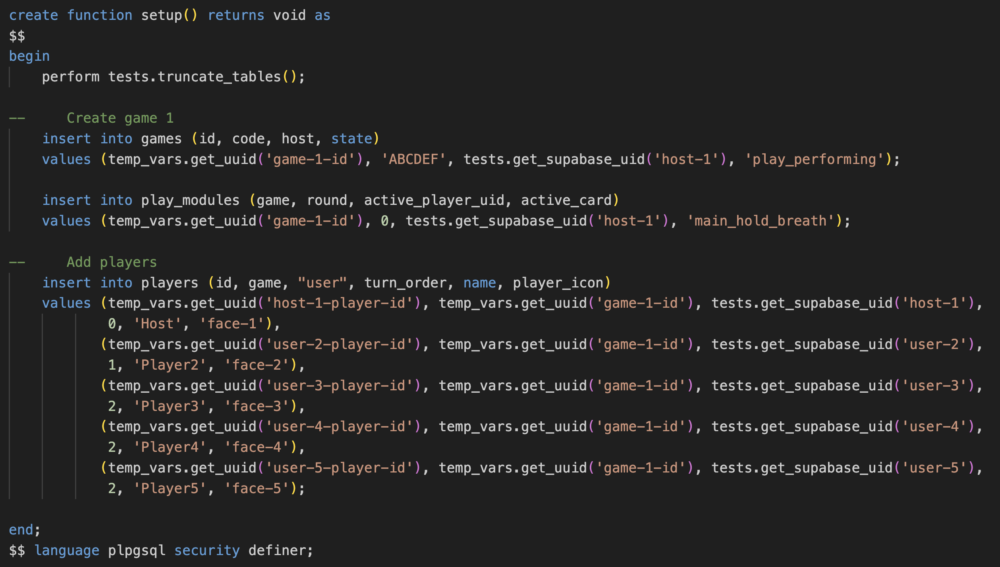
3. Seed Data with Secrets
    - In supabase, a root `seed.sql` file is used for seeding the database, however that file can get pretty cluttered, and it is impossible to include environment secrets, so I created a script that takes a directory of seed files and compiles them into a single `seed.sql` file. Then, I was able to include a `secret_env.sql` script which writes env variables to a hidden table that can be only accessed by admins during seeding (so that we can protect sensitive data like test user passwords). 
    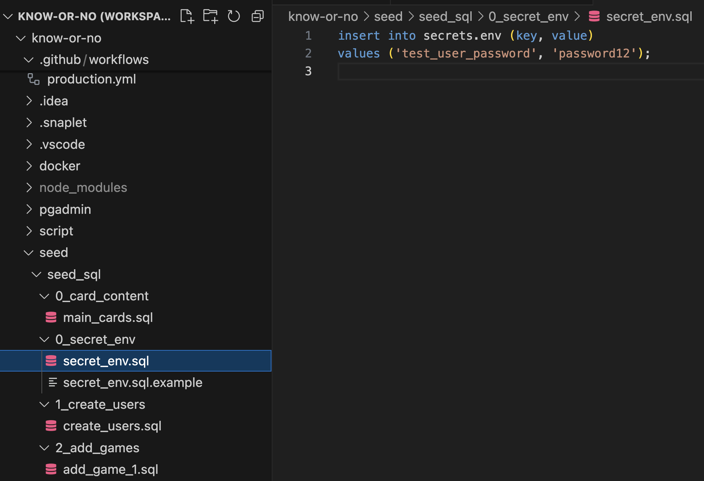
    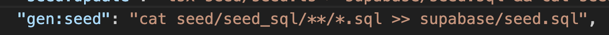
    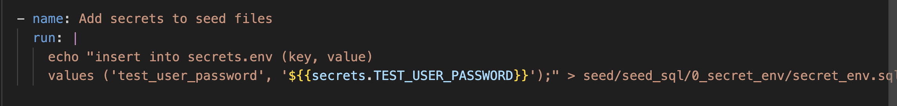

## Writing Tests
After I figured out how to implement the above utilities that would help me write concise, descriptive, isolated, secure, and repeatable tests, I got to work.

The following is a list of the test suites that I wrote:
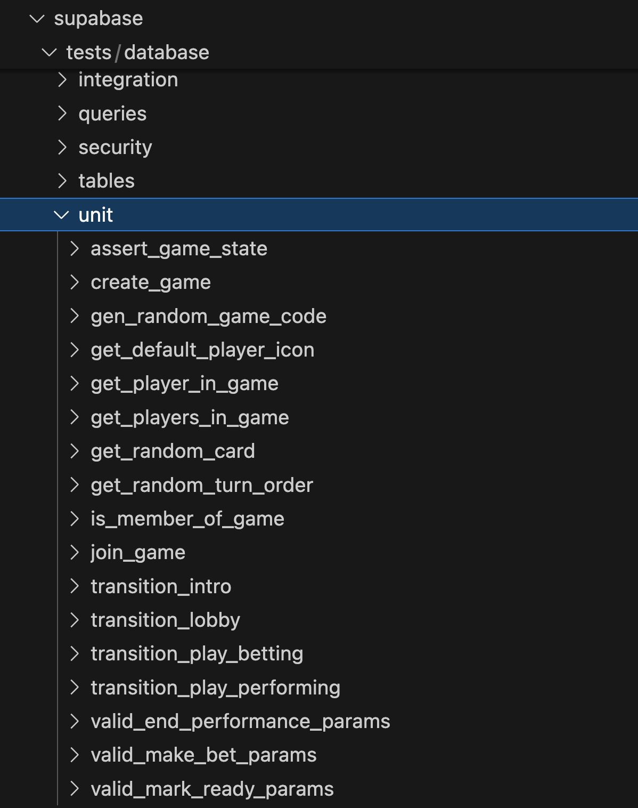

Here are some examples of tests:
### Join Game:
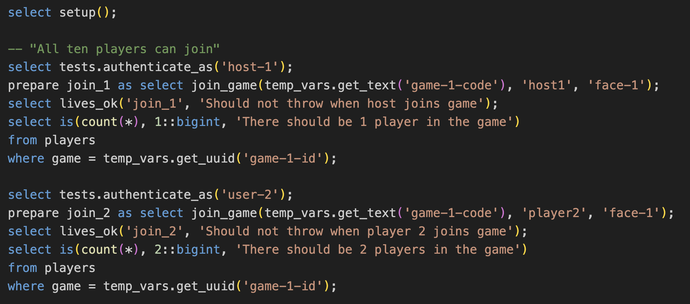
### End Performance Phase:
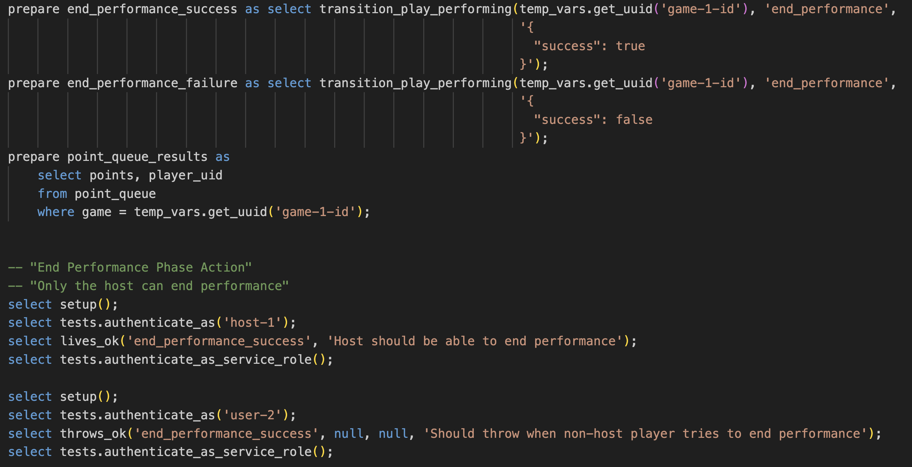
### Player Make Bet:
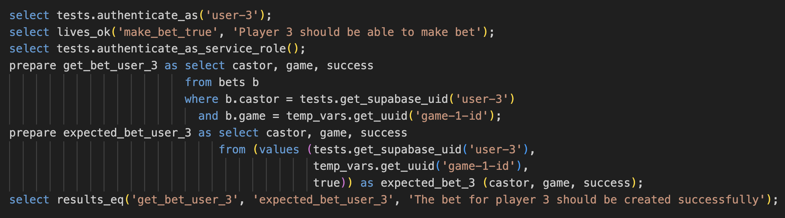

In total I wrote around 122 tests, which helped me to verify that the code I wrote worked as intended, and it also helped us to inform design decisions and refactor some parts of the code. I found that testing was essential, since PLPGSQL is hard to debug, but having test scenarios written out made it easy to copy and past the setup and then run queries individually to identify and fix problems.

## Continuous Integration
I wanted to ensure code quality and functionality, so I added a testing step to my GitHub Workflow:
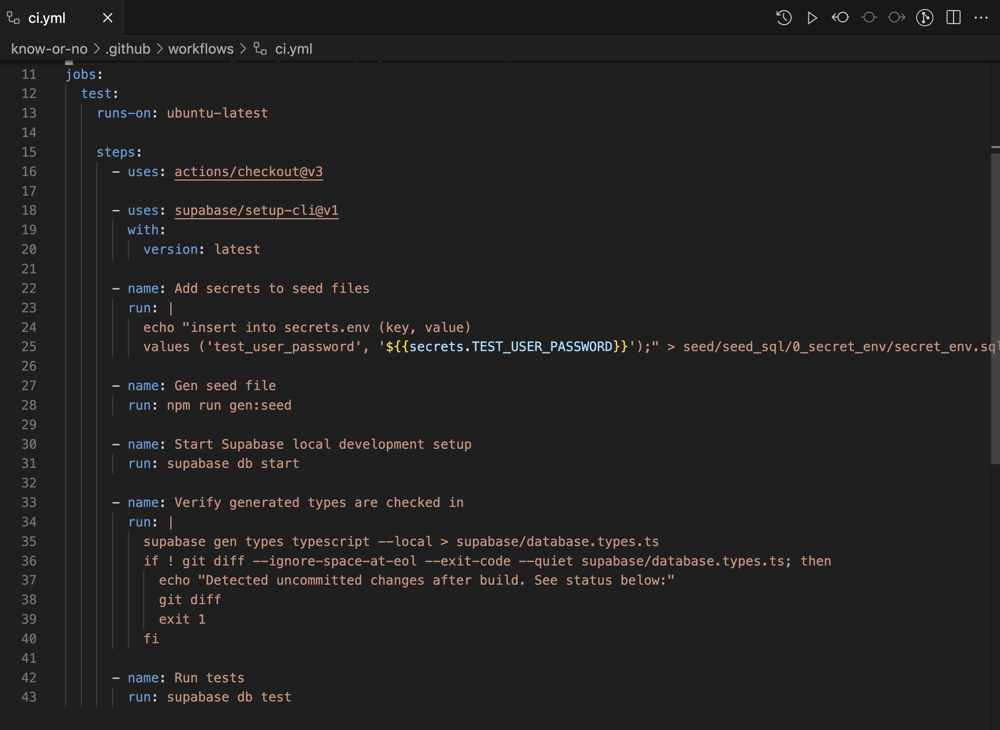
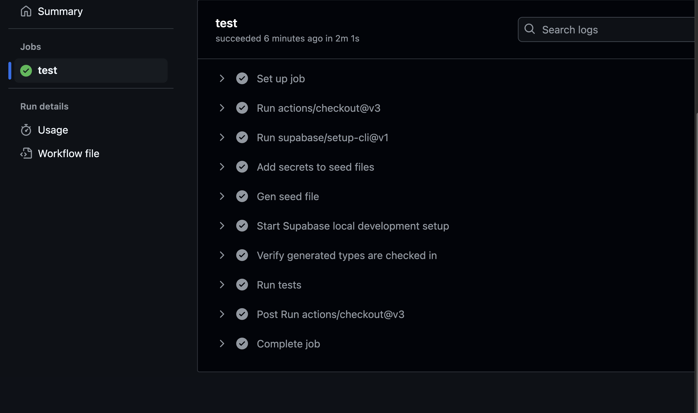
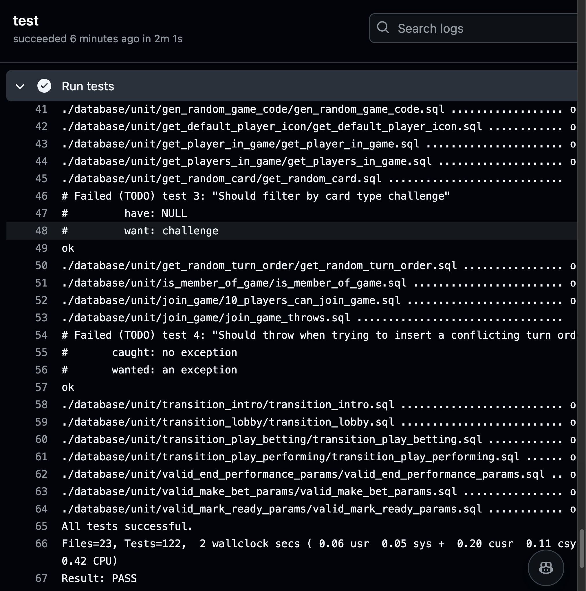

# Conclusion
It was fairly challenging to get my tests readable and repeatable without helpful variable management and lifecycle functions, but after I figured out solutions for that, pgTap became a life saver for my project. Testing helped increase my confidence that the code works as intended, and the upside of testing directly in postgres (as opposed to writing integration tests where I call the postgres functions from javascript) is that there is less operational overhead and the tests run insanely fast. It also isolates any issues to the PLPGSQL code, so I don't have to wonder if its a javascript problem.